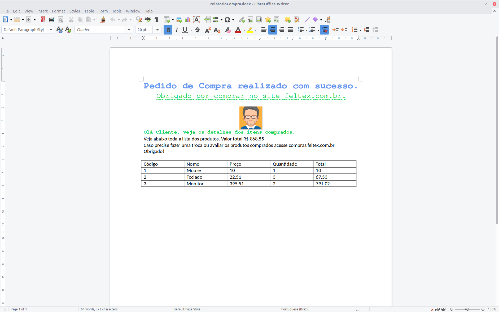

# Java Word

  Aprenda como criar arquivos MS word utilizando Java.

 Criaremos 2 exemplos:
- Um básico com os conceitos de criação de arquivos 
- Outro que cria um relatório de compras contendo a lista de produtos.
  
## Tecnologias

- [Java 11](https://youtu.be/_NCt_82M0MA)
- [Maven](https://youtu.be/edF1G8RYDTU)
- [Apache POI](https://poi.apache.org/)

## Exemplo

## 📺 Link dos vídeos

 [Apache POI para iniciantes Word tutorial](https://youtu.be/JxTM7-WA3fE)
